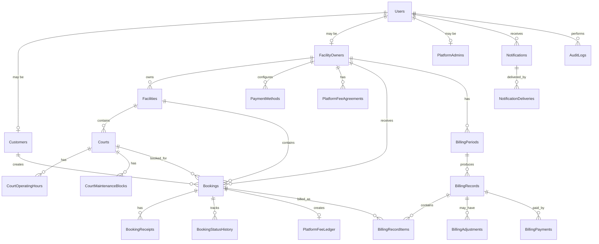

# Database Design

## Purpose

This document defines the initial database design for the Sports Facility Booking & Management Platform.

The design supports:

* Customer booking
* Facility Owner court management
* Direct customer payment to Facility Owner
* Payment receipt upload through Cloudinary
* Facility Owner payment verification
* Platform fee tracking
* Platform billing to Facility Owners
* Notifications
* Audit logging
* Reporting through EF Core and Dapper

---

## Design Principles

* Every important business event must be traceable.
* Bookings must be tied to exactly one court and one Facility Owner.
* Platform fee values must be stored on the booking so historical billing does not change when fee settings change.
* Payment receipts are stored in Cloudinary, while metadata is stored in SQL Server.
* The Platform does not store or process customer payment funds.
* Billing reports must trace totals back to booking records.
* Use EF Core for transactional workflows.
* Use Dapper for reporting and billing queries.

---

## Readable Data Relationship Overview



---

## Core Entity Flow

```text
Facility Owner
  |
  v
Facility
  |
  v
Court
  |
  v
Booking
  |
  +--> Booking Receipt
  |
  +--> Booking Status History
  |
  +--> Platform Fee Ledger
           |
           v
       Billing Record Item
           |
           v
       Billing Record
```

---

## Table Groups

Recommended table groups:

* Identity and roles
* Facility and court management
* Booking and payment verification
* Platform fee and billing
* Notifications
* Audit logging

---

## Identity and Roles

### Users

Stores shared login and identity information.

Important because every role starts from an authenticated user.

Suggested columns:

| Column | Type | Notes |
| --- | --- | --- |
| Id | uniqueidentifier | Primary key |
| Email | nvarchar(256) | Unique |
| PasswordHash | nvarchar(max) | If using local auth |
| FullName | nvarchar(200) | Display name |
| PhoneNumber | nvarchar(50) | Optional |
| IsActive | bit | Account status |
| EmailVerifiedAt | datetimeoffset | Null until the emailed link is opened |
| FailedLoginAttempts | int | Reset on a successful login or a password reset |
| LockoutEnd | datetimeoffset | Null when the account is not locked |
| CreatedAt | datetimeoffset | Created timestamp |
| UpdatedAt | datetimeoffset | Updated timestamp |

### RefreshTokens

One row per signed-in device. A user holds as many rows as they have live
sessions, which is what the account page reads to list and end them.

Raw refresh tokens are never persisted, only their SHA-256 hash. A copy of the
database therefore cannot be used to impersonate anyone.

Suggested columns:

| Column | Type | Notes |
| --- | --- | --- |
| Id | uniqueidentifier | Primary key, also the session id in the access token's `sid` claim |
| UserId | uniqueidentifier | Owner |
| TokenHash | nvarchar(64) | Unique. SHA-256 of the raw token |
| ExpiresAt | datetimeoffset | 30 days when remembered, 12 hours when not |
| RevokedAt | datetimeoffset | Set on logout, rotation, session revoke, or password reset |
| ReplacedByTokenHash | nvarchar(64) | Set when rotated, for tracing a token chain |
| IsPersistent | bit | The "remember me" choice, recorded per token |
| UserAgent | nvarchar(512) | Raw, unparsed. The client formats it for display |
| IpAddress | nvarchar(45) | Sized for IPv6 |
| LastUsedAt | datetimeoffset | Stamped on every rotation |
| CreatedAt | datetimeoffset | Sign-in time |
| UpdatedAt | datetimeoffset | Updated timestamp |

`IsPersistent` is stored rather than derived from `ExpiresAt - CreatedAt`,
because a rotation has to size the replacement token and timestamp arithmetic
would quietly promote a short session to a remembered one.

### EmailVerificationTokens

Single-use tokens behind the account verification link.

Suggested columns:

| Column | Type | Notes |
| --- | --- | --- |
| Id | uniqueidentifier | Primary key |
| UserId | uniqueidentifier | Owner |
| TokenHash | nvarchar(64) | Unique. SHA-256 of the raw token |
| ExpiresAt | datetimeoffset | 24 hours by default |
| UsedAt | datetimeoffset | Null until the link is opened |
| CreatedAt | datetimeoffset | Also drives the resend cooldown |
| UpdatedAt | datetimeoffset | Updated timestamp |

Issuing a new token deletes the user's earlier rows, so only one link is live at
a time.

### PasswordResetTokens

Same shape and same rules as `EmailVerificationTokens`, with a shorter life:
60 minutes rather than 24 hours. A reset link grants more than a verification
link does, so it is worth less time.

Suggested columns:

| Column | Type | Notes |
| --- | --- | --- |
| Id | uniqueidentifier | Primary key |
| UserId | uniqueidentifier | Owner |
| TokenHash | nvarchar(64) | Unique. SHA-256 of the raw token |
| ExpiresAt | datetimeoffset | 60 minutes by default |
| UsedAt | datetimeoffset | Null until the reset succeeds |
| CreatedAt | datetimeoffset | Also drives the request cooldown |
| UpdatedAt | datetimeoffset | Updated timestamp |

### UserRoles

Stores role assignments for each user.

Implementation note: the initial .NET 10 migration also stores failed-login counters and lockout expiry on `Users`, plus hashed, expiring, revocable refresh-token records in `RefreshTokens`. Raw refresh tokens are never persisted.

Important because the same authentication system supports Customer, Facility Owner, and Platform Administrator access.

Suggested columns:

| Column | Type | Notes |
| --- | --- | --- |
| Id | uniqueidentifier | Primary key |
| UserId | uniqueidentifier | FK to Users |
| Role | nvarchar(50) | Customer, FacilityOwner, PlatformAdmin |
| CreatedAt | datetimeoffset | Created timestamp |

### Customers

Stores Customer-specific profile data.

Important because Customers create bookings and upload payment receipts.

Suggested columns:

| Column | Type | Notes |
| --- | --- | --- |
| Id | uniqueidentifier | Primary key |
| UserId | uniqueidentifier | FK to Users |
| CreatedAt | datetimeoffset | Created timestamp |
| UpdatedAt | datetimeoffset | Updated timestamp |

### FacilityOwners

Stores Facility Owner profile and business account information.

Important because Facility Owners own courts, receive customer payments, verify receipts, and pay platform fees.

Suggested columns:

| Column | Type | Notes |
| --- | --- | --- |
| Id | uniqueidentifier | Primary key |
| UserId | uniqueidentifier | FK to Users |
| BusinessName | nvarchar(200) | Facility Owner business name |
| BillingEmail | nvarchar(256) | Where billing emails are sent |
| BillingPhone | nvarchar(50) | Optional |
| BusinessRegistrationNumber | nvarchar(100) | DTI, SEC or Mayor's permit number |
| IsActive | bit | The suspend switch. False overrides any contract |
| CreatedAt | datetimeoffset | Created timestamp |
| UpdatedAt | datetimeoffset | Updated timestamp |

There is deliberately **no status column**. Whether an owner is live is derived
from their contracts, so the two can never disagree:

| Derived status | When |
| --- | --- |
| Pending | Encoded, but no contract covers today and none ever has |
| Commenced | A contract covers today. The facility is bookable |
| Expired | Contracts exist, none covers today |
| Suspended | `IsActive` is false, whatever the contracts say |

A stored status eventually claims an owner is live three months after their term
lapsed, and nobody finds out until a customer books them.

### FacilityOwnerContracts

One commencement period per row. This is what makes an owner bookable, and what
platform fee pricing will attach to.

Suggested columns:

| Column | Type | Notes |
| --- | --- | --- |
| Id | uniqueidentifier | Primary key |
| FacilityOwnerId | uniqueidentifier | FK to FacilityOwners |
| StartDate | date | First day of the term |
| EndDate | date | Last day of the term, inclusive |
| CommencedByUserId | uniqueidentifier | The admin who commenced it |
| Notes | nvarchar(1000) | Optional, for the agreement reference |
| CancelledAt | datetimeoffset | Set when a term is ended early |
| CreatedAt | datetimeoffset | Created timestamp |
| UpdatedAt | datetimeoffset | Updated timestamp |

Its own table rather than two columns on the owner because contracts renew:
last year's term and this year's have to coexist, and pricing needs a specific
term to hang off rather than whatever dates happen to be current.

Indexed on `(FacilityOwnerId, StartDate, EndDate)`, which answers "is this
owner bookable today" in one seek.

### FacilityOwnerDocuments

Permit and identity document metadata. The files live in Cloudinary; only the
reference is stored, per **Cloudinary Upload Flow** in `api-design.md`.

Suggested columns:

| Column | Type | Notes |
| --- | --- | --- |
| Id | uniqueidentifier | Primary key |
| FacilityOwnerId | uniqueidentifier | FK to FacilityOwners |
| DocumentType | nvarchar(50) | BusinessPermit, GovernmentId, DtiSecRegistration |
| PublicId | nvarchar(300) | The Cloudinary public id. Source of truth for the asset |
| SecureUrl | nvarchar(1000) | Cloudinary's `secure_url`, never its `url` |
| FileName | nvarchar(255) | As uploaded |
| ContentType | nvarchar(100) | Image or PDF |
| SizeInBytes | bigint | Capped at 10 MB on the way in |
| CreatedAt | datetimeoffset | Uploaded timestamp |
| UpdatedAt | datetimeoffset | Updated timestamp |

The public id is what the application builds URLs from, so each surface can ask
for the size it needs. `SecureUrl` is stored alongside it and is validated on
the way in: an http URL, or one on another cloud, is rejected. The metadata is
posted by the browser, so it cannot be taken on trust.

### PlatformAdmins

Stores internal Platform Administrator profiles.

Important because Platform Administrators manage platform fee agreements, billing records, support overrides, and system operations.

Suggested columns:

| Column | Type | Notes |
| --- | --- | --- |
| Id | uniqueidentifier | Primary key |
| UserId | uniqueidentifier | FK to Users |
| CreatedAt | datetimeoffset | Created timestamp |
| UpdatedAt | datetimeoffset | Updated timestamp |

---

## Facility and Court Management

### Facilities

Stores sports facility records owned by Facility Owners.

Important because a Facility Owner can manage multiple facilities.

Columns:

| Column | Type | Notes |
| --- | --- | --- |
| Id | uniqueidentifier | Primary key |
| FacilityOwnerId | uniqueidentifier | FK to FacilityOwners |
| Name | nvarchar(200) | Facility name |
| Slug | nvarchar(220) | Unique. The public URL segment |
| Description | nvarchar(max) | Optional |
| AddressLine1 | nvarchar(300) | Address |
| AddressLine2 | nvarchar(300) | Optional |
| City | nvarchar(100) | City |
| Province | nvarchar(100) | Province |
| PostalCode | nvarchar(20) | Optional |
| Country | nvarchar(100) | Country |
| Latitude | decimal(9,6) | Null until the pin is dropped |
| Longitude | decimal(9,6) | Null until the pin is dropped |
| TimeZone | nvarchar(100) | IANA zone. Example: Asia/Manila |
| ContactPhone | nvarchar(50) | Public contact, not the billing one |
| ContactEmail | nvarchar(256) | Public contact, not the billing one |
| SafetyMeasures | nvarchar(max) | Free text beside the amenity checklist |
| HouseRules | nvarchar(max) | Free text beside the amenity checklist |
| IsActive | bit | Visibility and operational status |
| CreatedAt | datetimeoffset | Created timestamp |
| UpdatedAt | datetimeoffset | Updated timestamp |

The slug is stored rather than derived from the name, so renaming a facility
cannot silently break every link already shared. Onboarding suffixes a
collision (`abc-sports-center-2`) instead of rejecting it, because two venues
legitimately share a name across two cities.

The coordinates are nullable and are written as a pair: a latitude without a
longitude points nowhere, so setting one without the other clears both. A
facility with no pin is encoded but not yet mappable, which is the state every
facility starts in until someone opens the map.

The public contact is deliberately separate from the billing contact on
`FacilityOwners`. The number a customer rings to ask about a court is rarely
the one the platform sends invoices to.

### FacilityOperatingHours

Normal opening hours for a facility. Seven rows, one per day.

Suggested columns:

| Column | Type | Notes |
| --- | --- | --- |
| Id | uniqueidentifier | Primary key |
| FacilityId | uniqueidentifier | FK to Facilities |
| DayOfWeek | int | 0-6, framework enum |
| OpensAt | time | Null when closed |
| ClosesAt | time | Null when closed |
| CreatedAt | datetimeoffset | Created timestamp |
| UpdatedAt | datetimeoffset | Updated timestamp |

Hours live on the facility rather than on each court so an owner with eight
courts types the schedule once; `CourtOperatingHours` becomes the exception for
the outdoor court that closes early.

Closed is expressed by leaving both times empty, not by a separate flag. A flag
can disagree with the hours beside it; an absent pair cannot. Half a pair is
rejected, because an opening time with no closing time is an unfinished answer
rather than a closed day.

Unique on `(FacilityId, DayOfWeek)`, so a facility cannot hold two answers for
Monday.

Times are wall-clock values read in the facility's own `TimeZone`, never in UTC
and never in the server's zone.

### Amenities

A seeded lookup of what a facility offers, grouped into Safety, Comfort, Access
and Equipment.

Suggested columns:

| Column | Type | Notes |
| --- | --- | --- |
| Id | uniqueidentifier | Primary key |
| Key | nvarchar(100) | Unique, stable identifier such as `first-aid-kit` |
| Name | nvarchar(150) | Display name |
| Category | nvarchar(50) | Safety, Comfort, Access, Equipment |
| DisplayOrder | int | Order within the category |
| IsActive | bit | Retire an amenity without deleting history |
| CreatedAt | datetimeoffset | Created timestamp |
| UpdatedAt | datetimeoffset | Updated timestamp |

A lookup table rather than an enum, so an amenity can be added without a deploy
and the customer-facing filter has something to read. Seeded through
`HasData` the way `EmailTemplates` already is, with ids derived from the key so
re-running the generator cannot produce a second row for the same amenity.

### FacilityAmenities

Joins a facility to one amenity. Unique on `(FacilityId, AmenityId)`.

The FK to `Amenities` is `Restrict`, not `Cascade`: an amenity in use must not
vanish from under the facilities that reference it. Retire it with `IsActive`
instead.

### Courts

Stores bookable courts under a facility.

Important because every booking belongs to one court.

Suggested columns:

| Column | Type | Notes |
| --- | --- | --- |
| Id | uniqueidentifier | Primary key |
| FacilityId | uniqueidentifier | FK to Facilities |
| FacilityOwnerId | uniqueidentifier | Denormalized for scoping and reporting |
| Name | nvarchar(200) | Court name |
| SportType | nvarchar(100) | Badminton, basketball, etc. |
| BasePrice | decimal(18,2) | Default rental price |
| PriceUnit | nvarchar(50) | PerHour, PerSlot |
| IsActive | bit | Bookable status |
| CreatedAt | datetimeoffset | Created timestamp |
| UpdatedAt | datetimeoffset | Updated timestamp |

### CourtOperatingHours

Stores normal bookable hours for a court.

Important because availability depends on operating hours.

Suggested columns:

| Column | Type | Notes |
| --- | --- | --- |
| Id | uniqueidentifier | Primary key |
| CourtId | uniqueidentifier | FK to Courts |
| DayOfWeek | int | 0-6 or framework enum |
| OpensAt | time | Opening time |
| ClosesAt | time | Closing time |
| IsClosed | bit | Closed for this day |

### CourtMaintenanceBlocks

Stores blocked time ranges when a court is unavailable.

Important because maintenance and closures must prevent bookings.

Suggested columns:

| Column | Type | Notes |
| --- | --- | --- |
| Id | uniqueidentifier | Primary key |
| CourtId | uniqueidentifier | FK to Courts |
| StartsAt | datetimeoffset | Block start |
| EndsAt | datetimeoffset | Block end |
| Reason | nvarchar(300) | Maintenance, private event, closure |
| CreatedByUserId | uniqueidentifier | FK to Users |
| CreatedAt | datetimeoffset | Created timestamp |

---

## Payment Setup

### PaymentMethods

Stores Facility Owner payment QR Codes and payment instructions.

Important because Customers pay Facility Owners directly using these details.

Suggested columns:

| Column | Type | Notes |
| --- | --- | --- |
| Id | uniqueidentifier | Primary key |
| FacilityOwnerId | uniqueidentifier | FK to FacilityOwners |
| MethodType | nvarchar(50) | GCash, Maya, BankTransfer, Manual |
| DisplayName | nvarchar(150) | User-facing label |
| AccountName | nvarchar(200) | Payment account name |
| AccountNumber | nvarchar(100) | Optional |
| Instructions | nvarchar(max) | Optional manual instructions |
| QrImageCloudinaryPublicId | nvarchar(300) | Cloudinary public ID |
| QrImageSecureUrl | nvarchar(1000) | Optional cached secure URL |
| IsActive | bit | Only active methods appear during booking |
| CreatedAt | datetimeoffset | Created timestamp |
| UpdatedAt | datetimeoffset | Updated timestamp |

### PlatformFeeAgreements

Stores platform fee rules per Facility Owner.

Important because platform fees are configurable depending on agreement.

Suggested columns:

| Column | Type | Notes |
| --- | --- | --- |
| Id | uniqueidentifier | Primary key |
| FacilityOwnerId | uniqueidentifier | FK to FacilityOwners |
| FeeModel | nvarchar(50) | PerHour, Custom |
| RatePerHour | decimal(18,2) | Platform fee rate per booked hour |
| CashbackPercentage | decimal(9,4) | Optional billing-level cashback percentage |
| BillingCycle | nvarchar(50) | Daily, Weekly, Monthly, Custom |
| EffectiveFrom | datetimeoffset | Start date |
| EffectiveTo | datetimeoffset | Optional end date |
| IsActive | bit | Current agreement |
| CreatedAt | datetimeoffset | Created timestamp |
| UpdatedAt | datetimeoffset | Updated timestamp |

### PlatformFeeAgreementRanges

Stores discounted platform fee ranges for longer bookings.

Important because platform fee agreements may charge less when booking duration reaches a configured threshold.

Suggested columns:

| Column | Type | Notes |
| --- | --- | --- |
| Id | uniqueidentifier | Primary key |
| PlatformFeeAgreementId | uniqueidentifier | FK to PlatformFeeAgreements |
| MinimumDurationMinutes | int | Required duration threshold |
| MaximumDurationMinutes | int | Optional upper limit |
| FlatFeeAmount | decimal(18,2) | Discounted platform fee for the range |
| Label | nvarchar(100) | Example: 4-hour rate, Daily rate |
| IsActive | bit | Active range |
| CreatedAt | datetimeoffset | Created timestamp |
| UpdatedAt | datetimeoffset | Updated timestamp |

---

## Booking and Payment Verification

### Bookings

Stores booking records.

Important because this is the central transaction of the system.

Suggested columns:

| Column | Type | Notes |
| --- | --- | --- |
| Id | uniqueidentifier | Primary key |
| BookingNumber | nvarchar(50) | Human-readable reference |
| CustomerId | uniqueidentifier | FK to Customers |
| FacilityOwnerId | uniqueidentifier | FK to FacilityOwners |
| FacilityId | uniqueidentifier | FK to Facilities |
| CourtId | uniqueidentifier | FK to Courts |
| StartsAt | datetimeoffset | Booking start |
| EndsAt | datetimeoffset | Booking end |
| Status | nvarchar(50) | Draft, PendingPayment, PendingVerification, Confirmed, Rejected, Cancelled, Expired |
| CourtRentalAmount | decimal(18,2) | Stored amount at booking time |
| BookingDurationMinutes | int | Used for pricing and platform fee calculation |
| PlatformFeeAmount | decimal(18,2) | Stored fee at booking time |
| PlatformRatePerHour | decimal(18,2) | Snapshot from active platform fee agreement |
| PlatformFeeRangeId | uniqueidentifier | Optional FK to applied range |
| TotalPayableAmount | decimal(18,2) | Rental plus platform fee |
| PlatformFeeAgreementId | uniqueidentifier | FK to PlatformFeeAgreements |
| PaymentMethodId | uniqueidentifier | FK to PaymentMethods shown to customer |
| PaymentDueAt | datetimeoffset | Receipt upload deadline |
| ConfirmedAt | datetimeoffset | Nullable |
| RejectedAt | datetimeoffset | Nullable |
| CancelledAt | datetimeoffset | Nullable |
| ExpiredAt | datetimeoffset | Nullable |
| CreatedAt | datetimeoffset | Created timestamp |
| UpdatedAt | datetimeoffset | Updated timestamp |

### BookingReceipts

Stores receipt metadata for uploaded customer payment proof.

Important because the actual file lives in Cloudinary, but verification needs metadata.

Suggested columns:

| Column | Type | Notes |
| --- | --- | --- |
| Id | uniqueidentifier | Primary key |
| BookingId | uniqueidentifier | FK to Bookings |
| UploadedByCustomerId | uniqueidentifier | FK to Customers |
| CloudinaryPublicId | nvarchar(300) | Cloudinary public ID |
| CloudinarySecureUrl | nvarchar(1000) | Optional cached secure URL |
| FileName | nvarchar(255) | Original file name |
| ContentType | nvarchar(100) | Image or PDF MIME type |
| FileSizeBytes | bigint | File size |
| UploadedAt | datetimeoffset | Upload timestamp |
| VerificationStatus | nvarchar(50) | Uploaded, Verified, Rejected |
| VerifiedByUserId | uniqueidentifier | FK to Users |
| VerifiedAt | datetimeoffset | Nullable |
| RejectionReason | nvarchar(500) | Nullable |

### BookingStatusHistory

Stores every booking status change.

Important because status changes must be auditable and traceable.

Suggested columns:

| Column | Type | Notes |
| --- | --- | --- |
| Id | uniqueidentifier | Primary key |
| BookingId | uniqueidentifier | FK to Bookings |
| PreviousStatus | nvarchar(50) | Nullable for first status |
| NewStatus | nvarchar(50) | New status |
| ChangedByUserId | uniqueidentifier | FK to Users |
| ChangedByRole | nvarchar(50) | Customer, FacilityOwner, PlatformAdmin, System |
| Reason | nvarchar(500) | Optional |
| CreatedAt | datetimeoffset | Status change timestamp |

### PlatformFeeLedger

Stores the billable platform fee record created from a confirmed booking.

Important because billing should not rely only on recalculating booking totals.

Suggested columns:

| Column | Type | Notes |
| --- | --- | --- |
| Id | uniqueidentifier | Primary key |
| BookingId | uniqueidentifier | FK to Bookings |
| FacilityOwnerId | uniqueidentifier | FK to FacilityOwners |
| PlatformFeeAmount | decimal(18,2) | Billable fee |
| BookingDurationMinutes | int | Booking duration snapshot |
| RatePerHour | decimal(18,2) | Rate snapshot |
| PlatformFeeRangeId | uniqueidentifier | Optional applied range |
| Status | nvarchar(50) | PendingBilling, Billed, Reversed |
| BillableAt | datetimeoffset | When fee became billable |
| BillingRecordId | uniqueidentifier | FK to BillingRecords, nullable until billed |
| CreatedAt | datetimeoffset | Created timestamp |

---

## Billing

### BillingPeriods

Stores billing windows for Facility Owners.

Important because billing can be daily, weekly, monthly, or custom.

Suggested columns:

| Column | Type | Notes |
| --- | --- | --- |
| Id | uniqueidentifier | Primary key |
| FacilityOwnerId | uniqueidentifier | FK to FacilityOwners |
| BillingCycle | nvarchar(50) | Daily, Weekly, Monthly, Custom |
| PeriodStart | datetimeoffset | Inclusive start |
| PeriodEnd | datetimeoffset | Inclusive or exclusive end, define in implementation |
| Status | nvarchar(50) | Open, Closed, Billed |
| CreatedAt | datetimeoffset | Created timestamp |

### BillingRecords

Stores platform billing records or invoices sent to Facility Owners.

Important because this is what Facility Owners pay to the Platform.

Suggested columns:

| Column | Type | Notes |
| --- | --- | --- |
| Id | uniqueidentifier | Primary key |
| BillingNumber | nvarchar(50) | Human-readable reference |
| FacilityOwnerId | uniqueidentifier | FK to FacilityOwners |
| BillingPeriodId | uniqueidentifier | FK to BillingPeriods |
| Status | nvarchar(50) | Draft, Generated, Sent, Viewed, Paid, PartiallyPaid, Overdue, Cancelled, Adjusted |
| TotalBookings | int | Included booking count |
| TotalCourtRentalAmount | decimal(18,2) | Informational |
| TotalCustomerPaidAmount | decimal(18,2) | Informational |
| GrossPlatformFeeAmount | decimal(18,2) | Total billable platform fees before cashback and adjustments |
| CashbackPercentage | decimal(9,4) | Billing-level cashback percentage |
| CashbackAmount | decimal(18,2) | Cashback credit amount |
| TotalAdjustments | decimal(18,2) | Adjustment total |
| NetAmountDue | decimal(18,2) | GrossPlatformFeeAmount minus CashbackAmount plus adjustments |
| DueDate | datetimeoffset | Due date |
| GeneratedAt | datetimeoffset | Nullable |
| SentAt | datetimeoffset | Nullable |
| PaidAt | datetimeoffset | Nullable |
| CreatedAt | datetimeoffset | Created timestamp |
| UpdatedAt | datetimeoffset | Updated timestamp |

### BillingRecordItems

Stores booking-level line items included in a billing record.

Important because every billing total must trace back to bookings.

Suggested columns:

| Column | Type | Notes |
| --- | --- | --- |
| Id | uniqueidentifier | Primary key |
| BillingRecordId | uniqueidentifier | FK to BillingRecords |
| BookingId | uniqueidentifier | FK to Bookings |
| CourtId | uniqueidentifier | FK to Courts |
| CourtRentalAmount | decimal(18,2) | Snapshot |
| PlatformFeeAmount | decimal(18,2) | Snapshot |
| TotalCustomerPaidAmount | decimal(18,2) | Snapshot |
| CreatedAt | datetimeoffset | Created timestamp |

### BillingAdjustments

Stores manual adjustments to billing records.

Important because adjustments must not overwrite original booking amounts.

Suggested columns:

| Column | Type | Notes |
| --- | --- | --- |
| Id | uniqueidentifier | Primary key |
| BillingRecordId | uniqueidentifier | FK to BillingRecords |
| Amount | decimal(18,2) | Positive or negative |
| Reason | nvarchar(500) | Required |
| CreatedByUserId | uniqueidentifier | FK to Users |
| CreatedAt | datetimeoffset | Created timestamp |

### BillingPayments

Stores payments made by Facility Owners to the Platform.

Important because MVP may use manual payment confirmation.

Suggested columns:

| Column | Type | Notes |
| --- | --- | --- |
| Id | uniqueidentifier | Primary key |
| BillingRecordId | uniqueidentifier | FK to BillingRecords |
| AmountPaid | decimal(18,2) | Payment amount |
| PaymentMethod | nvarchar(100) | BankTransfer, GCash, Maya, Manual |
| PaymentReference | nvarchar(200) | Optional reference |
| PaidAt | datetimeoffset | Payment date |
| ConfirmedByUserId | uniqueidentifier | FK to Users |
| Notes | nvarchar(500) | Optional |
| CreatedAt | datetimeoffset | Created timestamp |

---

## Notifications

### EmailTemplates

Maps a template key to the provider template that renders it. Lets an email be
re-pointed at a new provider template without a redeploy.

Suggested columns:

| Column | Type | Notes |
| --- | --- | --- |
| Id | uniqueidentifier | Primary key |
| Key | nvarchar(100) | For example `account-verification`, `password-reset` |
| Provider | nvarchar(50) | For example `Mailjet` |
| ExternalTemplateId | bigint | The provider's own template id |
| Subject | nvarchar(255) | Subject line sent with the template |
| IsActive | bit | Only the active row is used |
| CreatedAt | datetimeoffset | Created timestamp |
| UpdatedAt | datetimeoffset | Updated timestamp |

Unique on `(Provider, Key)`, so two active templates can never compete for the
same email. Credentials never live in this table; API keys stay in
configuration and the platform secret manager.

### Notifications

Stores persistent in-app notifications.

Important because SignalR messages can be missed when users are offline.

Suggested columns:

| Column | Type | Notes |
| --- | --- | --- |
| Id | uniqueidentifier | Primary key |
| RecipientUserId | uniqueidentifier | FK to Users |
| RecipientRole | nvarchar(50) | Customer, FacilityOwner, PlatformAdmin |
| Type | nvarchar(100) | BookingCreated, ReceiptUploaded, BillingOverdue, etc. |
| Title | nvarchar(200) | Notification title |
| Message | nvarchar(500) | Notification message |
| TargetEntityType | nvarchar(100) | Booking, BillingRecord, etc. |
| TargetEntityId | uniqueidentifier | Target ID |
| TargetUrl | nvarchar(500) | Optional app URL |
| IsRead | bit | Read state |
| CreatedAt | datetimeoffset | Created timestamp |
| ReadAt | datetimeoffset | Nullable |

### NotificationDeliveries

Stores channel delivery attempts.

Important because email and push delivery should be retryable and auditable.

Suggested columns:

| Column | Type | Notes |
| --- | --- | --- |
| Id | uniqueidentifier | Primary key |
| NotificationId | uniqueidentifier | FK to Notifications |
| Channel | nvarchar(50) | SignalR, Email, Push, SMS |
| Provider | nvarchar(100) | Mailjet, Firebase, etc. |
| Status | nvarchar(50) | Pending, Sent, Failed, Cancelled |
| AttemptCount | int | Retry count |
| LastAttemptedAt | datetimeoffset | Nullable |
| DeliveredAt | datetimeoffset | Nullable |
| FailureReason | nvarchar(500) | Nullable |

### PushSubscriptions

Stores browser push notification tokens for future PWA support.

Important for Version 1.5 browser push notifications.

Suggested columns:

| Column | Type | Notes |
| --- | --- | --- |
| Id | uniqueidentifier | Primary key |
| UserId | uniqueidentifier | FK to Users |
| Provider | nvarchar(100) | Firebase |
| Token | nvarchar(max) | FCM token |
| DeviceName | nvarchar(200) | Optional |
| IsActive | bit | Active subscription |
| CreatedAt | datetimeoffset | Created timestamp |
| UpdatedAt | datetimeoffset | Updated timestamp |

---

## Audit

### AuditLogs

Stores important user and system actions.

Important because bookings, verification, billing, and support operations must be traceable.

Suggested columns:

| Column | Type | Notes |
| --- | --- | --- |
| Id | uniqueidentifier | Primary key |
| ActorUserId | uniqueidentifier | FK to Users, nullable for system |
| ActorRole | nvarchar(50) | Customer, FacilityOwner, PlatformAdmin, System |
| Action | nvarchar(150) | BookingConfirmed, BillingPaid, etc. |
| EntityType | nvarchar(100) | Booking, BillingRecord, PaymentMethod |
| EntityId | uniqueidentifier | Entity ID |
| OldValuesJson | nvarchar(max) | Optional |
| NewValuesJson | nvarchar(max) | Optional |
| Reason | nvarchar(500) | Optional |
| IpAddress | nvarchar(100) | Optional |
| UserAgent | nvarchar(500) | Optional |
| CreatedAt | datetimeoffset | Timestamp |

---

## Recommended Indexes

Recommended indexes for MVP:

* `Users.Email` unique
* `Customers.UserId` unique
* `FacilityOwners.UserId` unique
* `Facilities.FacilityOwnerId`
* `Courts.FacilityId`
* `Courts.FacilityOwnerId`
* `Bookings.CustomerId`
* `Bookings.FacilityOwnerId`
* `Bookings.CourtId`
* `Bookings.Status`
* `Bookings.StartsAt, Bookings.EndsAt`
* `Bookings.CourtId, StartsAt, EndsAt`
* `BookingReceipts.BookingId`
* `PlatformFeeLedger.BookingId` unique
* `PlatformFeeLedger.FacilityOwnerId, Status`
* `BillingRecords.FacilityOwnerId, Status`
* `BillingRecords.BillingPeriodId`
* `BillingRecordItems.BillingRecordId`
* `BillingRecordItems.BookingId`
* `Notifications.RecipientUserId, IsRead`
* `AuditLogs.EntityType, EntityId`

---

## Reporting Notes

Dapper should be used for report-heavy queries such as:

* Court utilization
* Daily bookings
* Weekly bookings
* Monthly bookings
* Platform fee billing reports
* Facility Owner billing summaries
* Overdue billing reports

EF Core should be used for transactional workflows such as:

* Creating bookings
* Updating booking status
* Uploading receipt metadata
* Confirming or rejecting bookings
* Creating billing records
* Marking billing records as paid
* Writing audit logs

---

## MVP Table Priority

Build these first:

* Users
* UserRoles
* Customers
* FacilityOwners
* PlatformAdmins
* Facilities
* Courts
* CourtOperatingHours
* CourtMaintenanceBlocks
* PaymentMethods
* PlatformFeeAgreements
* Bookings
* BookingReceipts
* BookingStatusHistory
* PlatformFeeLedger
* BillingPeriods
* BillingRecords
* BillingRecordItems
* BillingAdjustments
* BillingPayments
* Notifications
* NotificationDeliveries
* AuditLogs

Add later:

* PushSubscriptions
* Advanced pricing tables
* Discount and promo tables
* Dispute workflow tables
* Native mobile device tables

---

## Related Documents

* `overview.md`
* `business-model.md`
* `user-roles.md`
* `booking-workflow.md`
* `payment-workflow.md`
* `billing-workflow.md`
* `notification-workflow.md`
* `architecture.md`
* `api-design.md`
